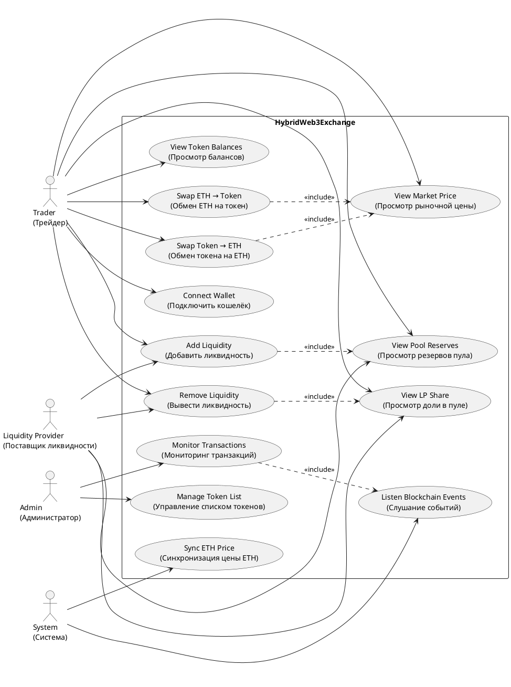
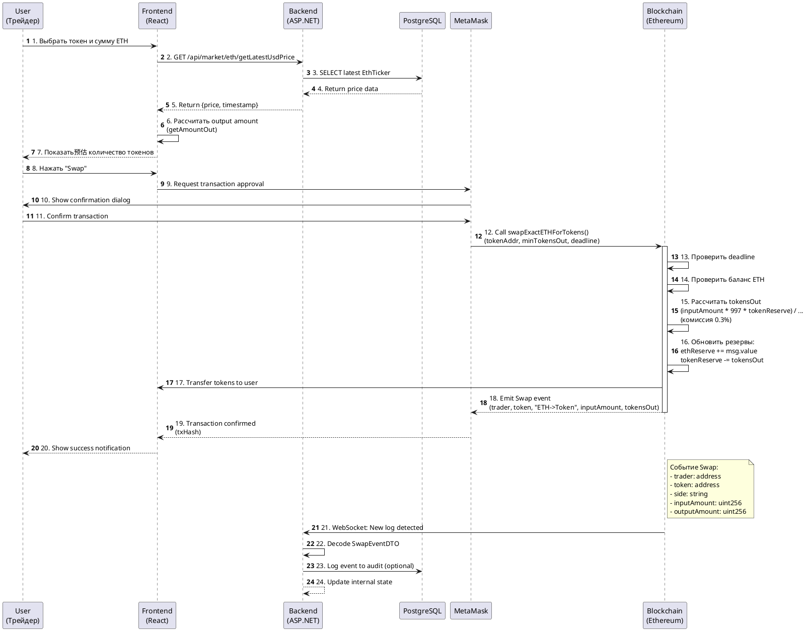
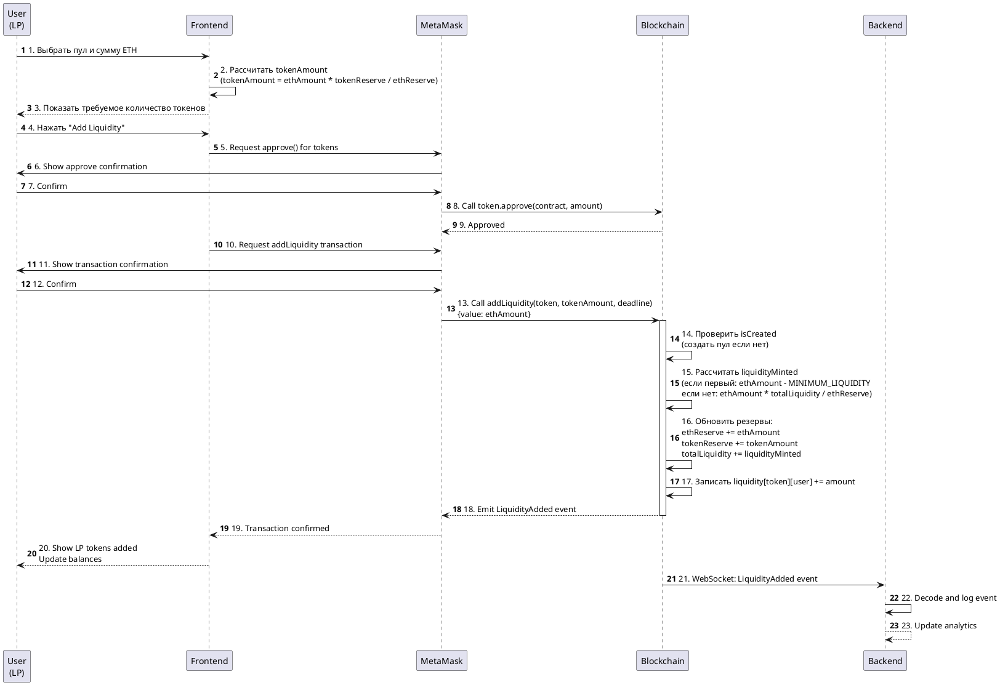
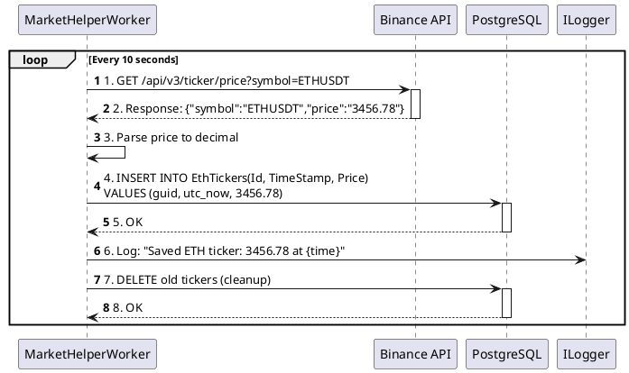

# HybridWeb3Exchange — Гибридная децентрализованная биржа (DEX)

## Описание программы для диплома

### Назначение системы

**HybridWeb3Exchange** — это гибридная децентрализованная биржа (DEX), построенная на блокчейне Ethereum, которая объединяет преимущества автоматического маркет-мейкера (AMM) с традиционным веб-интерфейсом для обеспечения удобной и безопасной торговли криптоактивами.

Система позволяет пользователям:
- Обменивать ETH на ERC-20 токены и обратно без посредников
- Предоставлять ликвидность в торговые пулы и получать доход от комиссий
- Отслеживать рыночные данные в реальном времени
- Управлять своими активами через децентрализованный интерфейс

### Архитектура системы

Система построена по трёхуровневой архитектуре:

```
┌─────────────────────────────────────────────────────────────────┐
│                        Frontend Layer                           │
│  React + TypeScript + Vite + Wagmi + ConnectKit                 │
│  (SwapPage, DashboardPage, TokenSwap, WalletConnect)            │
└─────────────────────────────────────────────────────────────────┘
                              │
                              ▼
┌─────────────────────────────────────────────────────────────────┐
│                      Backend Layer (ASP.NET)                    │
│  ASP.NET Core Web API + Entity Framework + PostgreSQL           │
│  (TokensController, MarketDataController, Background Workers)   │
└─────────────────────────────────────────────────────────────────┘
                              │
                              ▼
┌─────────────────────────────────────────────────────────────────┐
│                    Blockchain Layer (Ethereum)                  │
│  Solidity Smart Contracts (HybridExchangeAMM, MyToken)          │
│  (Hardhat, OpenZeppelin, Nethereum)                             │
└─────────────────────────────────────────────────────────────────┘
```

### Компоненты системы

#### 1. Smart Contract Layer (Hardhat Service)

**HybridExchangeAMM.sol** — основной контракт биржи:
- Реализует модель AMM с формулой постоянного продукта `x * y = k`
- Комиссия за обмен: 0.3%
- Функции: `addLiquidity()`, `removeLiquidity()`, `swapExactETHForTokens()`, `swapExactTokensForETH()`
- Поддержка fee-on-transfer токенов
- Защита от reentrancy (OpenZeppelin ReentrancyGuard)
- Механизм deadline для защиты от frontrunning

**MyToken.sol** — шаблон ERC-20 токенов для создания ликвидности.

#### 2. Backend Layer (ASP.NET Service)

**Контроллеры:**
- `TokensController` — CRUD операции для токенов (добавление, получение списка)
- `MarketDataController` — получение актуальных цен ETH/USDT

**Background Workers:**
- `BlockchainWorker` — прослушивание событий блокчейна через WebSocket (Swap, LiquidityAdded)
- `MarketHelperWorker` — периодический опрос Binance API для получения цен ETH

**База данных:** PostgreSQL с миграциями Entity Framework

**Сущности:**
- `Token` (Id, Name, Symbol, Address)
- `EthTicker` (Id, TimeStamp, Price)

#### 3. Frontend Layer (React Frontend)

**Страницы:**
- `HomePage` — главная страница
- `SwapPage` — интерфейс обмена токенов
- `DashBoardPage` — панель управления с балансами и пулами ликвидности

**Компоненты:**
- `TokenSwap` — форма обмена
- `WalletConnectButton` — подключение кошелька (MetaMask)
- `EthPriceTicker` — отображение цены ETH
- `BalanceCard`, `LiquidityPoolCard`, `UserInfoCard` — информационные карточки

**Технологии:** React 18, TypeScript, TailwindCSS, Wagmi, Viem, ConnectKit

---

## Use Case Диаграмма

### Акторы системы

| Актор | Описание |
|-------|----------|
| **Trader (Трейдер)** | Пользователь, осуществляющий обмен токенов |
| **Liquidity Provider (Поставщик ликвидности)** | Пользователь, предоставляющий активы в пулы |
| **Admin (Администратор)** | Управление списком токенов, мониторинг |
| **System (Система)** | Автоматические процессы (синхронизация цен, события) |

### Use Case Diagram (PlantUML)



### Текстовое описание Use Cases

#### UC1: Connect Wallet (Подключить кошелёк)
- **Актор:** Trader, LP
- **Предусловие:** Браузер с установленным MetaMask
- **Постусловие:** Кошелёк подключён, адрес доступен в приложении
- **Сценарий:**
  1. Пользователь нажимает "Connect Wallet"
  2. Frontend запрашивает подключение через Wagmi/ConnectKit
  3. MetaMask показывает запрос на подключение
  4. Пользователь подтверждает
  5. Адрес кошелька сохраняется в состоянии приложения

#### UC3: Swap ETH → Token
- **Актор:** Trader
- **Предусловие:** Кошелёк подключён, есть ETH на балансе
- **Постусловие:** Токены получены, баланс обновлён
- **Сценарий:**
  1. Пользователь выбирает токен и сумму ETH
  2. Система рассчитывает количество токенов (с учётом slippage)
  3. Пользователь подтверждает транзакцию
  4. Вызывается `swapExactETHForTokens()` в смарт-контракте
  5. Транзакция подписывается в MetaMask
  6. Событие `Swap` эмитится в блокчейн
  7. Backend фиксирует событие через WebSocket

#### UC6: Add Liquidity
- **Актор:** LP
- **Предусловие:** Кошелёк подключён, есть ETH и токены
- **Постусловие:** Ликвидность добавлена, LP-токены выпущены
- **Сценарий:**
  1. Пользователь выбирает пул и сумму ETH
  2. Система рассчитывает необходимое количество токенов
  3. Пользователь одобряет расход токенов (approve)
  4. Вызывается `addLiquidity()` с deadline
  5. Контракт блокирует ETH и токены
  6. Выпускаются LP-токены (внутренний учёт)
  7. Событие `LiquidityAdded` эмитится

#### UC12: Sync ETH Price
- **Актор:** System
- **Предусловие:** Backend запущен
- **Постусловие:** Цена ETH сохранена в БД
- **Сценарий:**
  1. `MarketHelperWorker` запускается каждые 10 секунд
  2. Запрос к Binance API: `GET /api/v3/ticker/price?symbol=ETHUSDT`
  3. Парсинг ответа
  4. Создание записи `EthTicker` в PostgreSQL
  5. Очистка старых записей (cleanup)

---

## Sequence Diagram (Диаграмма последовательности)

### Сценарий: Обмен ETH на токены (Swap ETH → Token)



### Сценарий: Добавление ликвидности (Add Liquidity)



### Сценарий: Синхронизация цены ETH (Background Process)



---

## Описание взаимодействия компонентов

### Общая схема взаимодействия

```
┌──────────────┐         HTTP/REST          ┌──────────────┐
│   Frontend   │◄──────────────────────────►│   Backend    │
│   (React)    │                            │  (ASP.NET)   │
└──────┬───────┘                            └──────┬───────┘
       │                                           │
       │ Web3 (Wagmi/Viem)                         │ WebSocket
       │                                           │ (Nethereum)
       ▼                                           ▼
┌──────────────┐         JSON-RPC          ┌──────────────┐
│   MetaMask   │◄──────────────────────────►│  Ethereum    │
│   (Wallet)   │                            │  Node (RPC)  │
└──────────────┘                            └──────┬───────┘
                                                   │
                                                   │ Smart Contract
                                                   ▼
                                          ┌──────────────┐
                                          │HybridExchange│
                                          │    AMM       │
                                          └──────────────┘
```

### Каналы связи

| Компонент A | Компонент B | Протокол | Назначение |
|-------------|-------------|----------|------------|
| Frontend | Backend | HTTP REST API | Получение списка токенов, цен ETH |
| Frontend | MetaMask | EIP-1193 (Provider) | Подписание транзакций, чтение баланса |
| Frontend | Ethereum Node | JSON-RPC (через Wagmi) | Чтение состояния контрактов |
| Backend | Ethereum Node | WebSocket (Nethereum) | Подписка на события смарт-контракта |
| Backend | PostgreSQL | TCP (Entity Framework) | Хранение токенов, исторических цен |
| Backend | Binance API | HTTPS REST | Получение актуальной цены ETH/USDT |

### API Endpoints Backend

#### Tokens API
```
GET  /api/tokens/get          — Получить все токены
GET  /api/tokens/get/{symbol} — Получить токен по символу
POST /api/tokens/add          — Добавить новый токен (требует OWNER-PRIVATE-KEY)
```

#### Market Data API
```
GET /api/market/eth/getLatestUsdPrice   — Последняя цена ETH
GET /api/market/eth/getAvgPriceChange   — Среднее изменение цены за период
```

### Структура базы данных

```sql
-- Tokens: Список поддерживаемых токенов
CREATE TABLE "Tokens" (
    "Id"       uuid PRIMARY KEY,
    "Name"     text NOT NULL,
    "Symbol"   text NOT NULL,
    "Address"  text NOT NULL  -- Ethereum address (0x...)
);

-- EthTickers: Исторические цены ETH/USDT
CREATE TABLE "EthTickers" (
    "Id"        uuid PRIMARY KEY,
    "TimeStamp" timestamp NOT NULL,
    "Price"     numeric NOT NULL
);
```

### Смарт-контракт: Основные функции

| Функция | Параметры | Возвращает | Описание |
|---------|-----------|------------|----------|
| `addLiquidity` | token, tokenAmount, deadline | liquidityMinted | Добавить ETH + токены в пул |
| `removeLiquidity` | token, liquidityAmount, deadline | ethAmount, tokenAmount | Вывести ликвидность из пула |
| `swapExactETHForTokens` | token, minTokensOut, deadline | tokensOut | Обменять ETH на токены |
| `swapExactTokensForETH` | token, tokenIn, minEthOut, deadline | ethOut | Обменять токены на ETH |
| `getReserves` | token | ethReserve, tokenReserve | Получить резервы пула |
| `getETHPriceInTokens` | token | price | Цена 1 ETH в токенах |
| `getTokenPriceInETH` | token | price | Цена 1 токена в ETH |

### События смарт-контракта (Events)

```solidity
event PoolCreated(address indexed token);
event LiquidityAdded(address indexed token, address indexed provider, 
                     uint256 ethAmount, uint256 tokenAmount, uint256 liquidityMinted);
event LiquidityRemoved(address indexed token, address indexed provider, 
                       uint256 ethAmount, uint256 tokenAmount, uint256 liquidityBurned);
event Swap(address indexed trader, address indexed token, string side, 
           uint256 inputAmount, uint256 outputAmount);
event Sync(address indexed token, uint256 ethReserve, uint256 tokenReserve);
```

### Docker Compose развёртывание

```yaml
services:
  frontend:  # React app (nginx)
    port: 80
    depends_on: backend
    
  backend:   # ASP.NET Core API
    port: 8080
    environment: PostgreSQL connection
    depends_on: db
    
  db:        # PostgreSQL 15
    port: 5432
    volumes: postgres_data
```

---

## Заключение

**HybridWeb3Exchange** представляет собой полнофункциональную децентрализованную биржу, которая сочетает в себе:

1. **Безопасность блокчейна** — все операции обмена и ликвидности выполняются через смарт-контракты Ethereum
2. **Удобство веб-интерфейса** — современный React-фронтенд с подключением через MetaMask
3. **Гибридную архитектуру** — backend для кэширования данных, аналитики и мониторинга событий
4. **AMM модель** — автоматическое ценообразование по формуле постоянного продукта с комиссией 0.3%

Система готова к развёртыванию через Docker Compose и поддерживает работу в тестовых сетях Ethereum (Goerli, Sepolia) или локальном блокчейне (Hardhat Network).

---

*Документация создана для дипломного проекта*  
*HybridWeb3Exchange © 2026*
